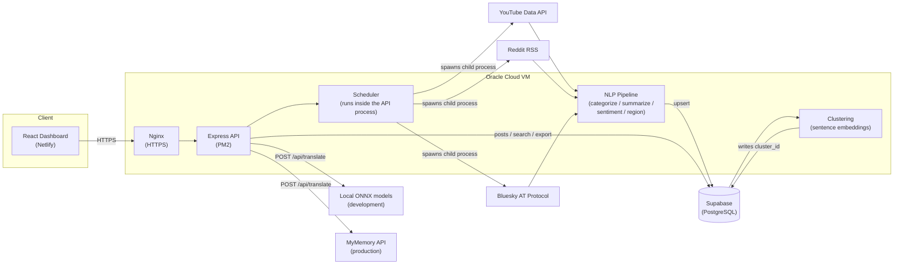

# Passport Social Dashboard

A dashboard that scrapes passport-related posts from YouTube, Reddit, and Bluesky, processes them through a local NLP pipeline (relevance filtering, gibberish detection, categorization, summarization, sentiment analysis, region detection, clustering), stores the results in Supabase, and presents them in a filterable, searchable, translatable React dashboard with CSV/PDF export.

Built for the Zebvo Newswire Full-Stack Development Task ("Social Media Scraper Dashboard").

## Live Demo

- **Dashboard:** <https://passport-social-dashboard.netlify.app>
- **API health check:** <https://144-24-140-31.sslip.io/api/health>

## Overview

The brief calls for a dashboard that aggregates passport-related social content from the last 24 hours, processes it with NLP, and presents it as a clean, filterable, multilingual feed. This implementation scrapes three platforms (YouTube, Reddit, Bluesky), runs each post through a categorization/summarization/sentiment/region pipeline, groups similar posts into clusters, and serves the result to a React frontend that supports filtering, keyword search, on-demand translation, and CSV/PDF export.

Every NLP step (categorization, summarization, sentiment, region detection, clustering) runs on locally-hosted models (`@xenova/transformers`, ONNX Runtime) rather than a hosted LLM API. Translation is separate: it runs on local ONNX models in development, and through the MyMemory translation API in production; Punjabi always uses a remote translation service regardless of mode (see [Translation](#translation) below).

## Features

- **Scraping** — YouTube (Data API v3), Reddit (RSS feeds from `/r/passport`, `/r/immigration`, `/r/india`, `/r/travel`), and Bluesky (AT Protocol search), each filtered to posts published in the last 24 hours. Runs on a recurring schedule inside the backend process.
- **Gibberish filtering** — heuristic detection of spam/bot content (repeated characters, high symbol density, repeated words, minimum length) combined with language detection. Flagged posts are stored but excluded from every read endpoint.
- **Relevance filtering** — regex-based detection of whether a post is actually about a passport document, distinct from gibberish detection.
- **Auto-categorization** — classifies posts into: Application, Renewal, Appointments, Tatkal, Visa, Travel Issues, Government Announcements, Scams/Fraud, News, Personal Experiences. Deterministic rules run first; a local zero-shot classification model handles anything the rules don't match.
- **Sentiment analysis** — Positive / Neutral / Negative via lexicon-based scoring.
- **Region detection** — keyword matching against a fixed list of countries and major cities.
- **Summarization** — a roughly 30-word summary per post, generated with a local neural summarization model (falling back to a deterministic sentence-compression method for short posts, questions, and promotional content).
- **Clustering** — groups semantically similar or duplicate posts together using sentence embeddings and cosine similarity, so the dashboard can show one topic instead of repeated posts.
- **Filtering & sorting** — by platform, region, creator/handle, language, category, sentiment, minimum engagement, and time range; sortable by recency or engagement.
- **Search** — keyword search across original text, AI summary, and saved translations.
- **Translation** — one-click, on-demand translation into up to 12 languages, cached per post so repeat requests are instant (see [Translation](#translation)).
- **Export** — CSV and PDF, both honoring the currently active filters, search term, and sort order.

## Technology Stack

**Backend:** Node.js, Express 5, Supabase (PostgreSQL client), `@xenova/transformers` (ONNX Runtime — zero-shot classification, summarization, sentence embeddings, and local translation models), `franc` (language detection), `sentiment` (lexicon-based sentiment scoring), `rss-parser` (Reddit), `json2csv` and `pdfkit` (exports), `cors`, `dotenv`.

**Frontend:** React 19, Vite, native `fetch` for API calls, no state-management library, no CSS framework.

**Database:** Supabase (hosted PostgreSQL).

**External services:** YouTube Data API v3, Reddit's public RSS feeds, Bluesky's AT Protocol API, and — depending on configuration — the MyMemory or LibreTranslate translation APIs.

## Architecture

A single Express process serves the API and also runs the scraping/clustering pipeline on a timer, entirely within the same process (there is no separate worker service). On startup it:

1. Registers the `/api/posts` and `/api/translate` routes.
2. Starts a scheduler that, by default, immediately runs one scrape cycle (YouTube → Reddit → Bluesky → clustering, each as a short-lived child process) and then repeats on a configurable interval. The immediate startup cycle is disabled in production (`SCRAPE_ON_STARTUP=false`); the recurring interval still applies there.
3. Optionally pre-loads local translation models in the background, depending on configuration.

Each scraper independently runs every scraped post through the same NLP pipeline (gibberish check → relevance check → categorization → summarization → sentiment → region detection) before upserting it into Supabase. Clustering runs afterward, across all relevant posts, using sentence embeddings to group similar stories under a shared cluster ID.

The React frontend fetches the processed feed from the API, applies filters/search/sort (both server-side and again client-side as a safety net), and renders posts individually or grouped into clusters.



## Data Flow

```text
YouTube / Reddit / Bluesky
        │
        ▼
Normalize + clean text
        │
        ▼
Gibberish + language detection
        │
        ▼
Relevance check
        │
        ├─ irrelevant / gibberish → stored, excluded from API
        │
        ▼ (relevant, not gibberish)
Categorization → Summarization → Sentiment → Region detection
        │
        ▼
Upsert into Supabase (posts table)
        │
        ▼
Clustering pass (after every scrape cycle)
        │
        ▼
Express API (filter / search / sort / export)
        │
        ▼
React dashboard (feed, clusters, translation, export)
```

## Project Structure

```text
backend/
  server.js                      Express app entry point; wires routes, starts the scheduler
  clusterPosts.js                Standalone clustering pass (also run by the scheduler)
  reprocessPosts.js              Standalone language-reprocessing maintenance script
  .env.example                   Template for required environment variables
  src/
    config/supabase.js           Supabase client
    controllers/                 postsController.js, translationController.js
    routes/                      postsRoutes.js, translationRoutes.js
    nlp/                         gibberishFilter, relevanceFilter, categorizer, summarizer,
                                  sentimentAnalyzer, regionDetector, clusterer, translator, translationWorker
    scrapers/                    youtube/, reddit/, bluesky/
    services/                    scraperScheduler.js, preserveTranslations.js

frontend/
  src/
    App.jsx                      Main dashboard component (state, data fetching, all UI sections)
    languageNames.js             Language code → display name lookup (UI labels only)
    App.css, index.css, translation.css

docs/
  API.md                         Full API reference
  postman_collection.json        Postman collection covering every endpoint
  schema.sql                     Supabase posts table schema (run once during setup)
```

## Setup

### Prerequisites

- Node.js 22 or later (required by `@supabase/supabase-js`)
- A Supabase project (see [Database Setup](#database-setup) below for the schema)
- A YouTube Data API v3 key
- A Bluesky account with an app password

### Database Setup

Run [`docs/schema.sql`](docs/schema.sql) in the Supabase SQL editor to create the `posts` table, its unique constraint, and its indexes before starting the backend for the first time.

### Backend

```bash
cd backend
npm install
cp .env.example .env   # then fill in real values
node server.js
```

There is also an `npm start` script (`node server.js`) if preferred. The server listens on port 5000 by default and starts the scraper scheduler and API together.

### Frontend

```bash
cd frontend
npm install
npm run dev       # Vite dev server
npm run build     # production build
```

See [`frontend/README.md`](frontend/README.md) for how the frontend's backend URL is configured.

## Environment Variables

All variables are read by the backend from `backend/.env` (see [`backend/.env.example`](backend/.env.example) for a template with placeholder values).

| Variable | Required | Default | Purpose |
|---|---|---|---|
| `SUPABASE_URL` | Yes | — | Supabase project URL |
| `SUPABASE_KEY` | Yes | — | Supabase API key |
| `YOUTUBE_API_KEY` | Yes | — | YouTube Data API v3 key, used by the YouTube scraper |
| `BLUESKY_IDENTIFIER` | Yes | — | Bluesky handle or email used to authenticate the Bluesky scraper |
| `BLUESKY_APP_PASSWORD` | Yes | — | Bluesky app password (not the main account password) |
| `BLUESKY_SEARCH_HOST` | No | `https://api.bsky.app` | Bluesky API host |
| `PORT` | No | `5000` | Port the Express server listens on |
| `SCRAPE_INTERVAL_MINUTES` | No | `20` | How often the scrape cycle repeats |
| `SCRAPE_ON_STARTUP` | No | `true` | Set to `"false"` to skip the immediate scrape cycle on boot (the recurring interval still applies) |
| `TRANSLATION_MODE` | No | `local` | `local` uses local ONNX translation models; `remote` uses the MyMemory API instead |
| `MYMEMORY_EMAIL` | No | *(none)* | Email sent with MyMemory requests when `TRANSLATION_MODE=remote`; raises the free daily character limit from 5,000 to 50,000 |
| `WARM_UP_MODELS` | No | `false` | Pre-load every local translation model at startup instead of loading lazily on first use (ignored when `TRANSLATION_MODE=remote`) |
| `LIBRETRANSLATE_URL` | No | `https://libretranslate.com/translate` | LibreTranslate endpoint, used only for Punjabi when `TRANSLATION_MODE=local` |
| `LIBRETRANSLATE_API_KEY` | No | *(none)* | API key for the LibreTranslate endpoint above |

The frontend has no environment variables — its backend URL is hardcoded in `frontend/src/App.jsx` (see [`frontend/README.md`](frontend/README.md)).

## API

Full endpoint documentation, including parameters, request/response shapes, and error cases, is in [`docs/API.md`](docs/API.md).

| Method | Path | Purpose |
|---|---|---|
| GET | `/api/health` | Liveness check |
| GET | `/api/test-db` | Supabase connectivity diagnostic |
| GET | `/api/posts` | Filtered, sorted feed |
| GET | `/api/posts/search` | Keyword search (original text, summary, translations) |
| GET | `/api/posts/export/csv` | CSV export (same filters/search/sort as the feed) |
| GET | `/api/posts/export/pdf` | PDF export (same filters/search/sort as the feed) |
| GET | `/api/translate/languages` | Supported translation target languages |
| POST | `/api/translate` | Translate text on demand, cached per post |

All endpoints are public — there is no authentication.

## Postman

A ready-to-import Postman v2.1 collection covering every endpoint above is at [`docs/postman_collection.json`](docs/postman_collection.json). It uses a `baseUrl` collection variable, set by default to the production API.

## Translation

The backend supports 12 target languages, all selectable from the dashboard's translate dropdown: English, Hindi, Spanish, French, German, Arabic, Chinese, Russian, Japanese, Vietnamese, Indonesian, and Punjabi.

Translation runs in one of two modes, controlled by `TRANSLATION_MODE`:

- **`local`** (default, used in development) — 11 languages are translated with local ONNX models running in a worker thread; Punjabi has no small local model, so it is routed through the LibreTranslate API instead.
- **`remote`** (used in production) — every language, including Punjabi, is translated through the free MyMemory API instead of loading any local model. This avoids the memory cost of local translation models on a memory-constrained host.

Either way, a translation tied to a post is cached in that post's database record, so a repeat request for the same post and language is served instantly from the cache instead of being translated again.

## Export

`GET /api/posts/export/csv` and `GET /api/posts/export/pdf` reuse the exact same filtering and sorting logic as `GET /api/posts`, plus the active search term if one is set. The dashboard's Feed/Clusters view toggle is a display-only grouping and has no effect on exports — an export always contains one row per matching post.

## Scalability

Measures already in place:

- **Batch upserts** — each scraper writes its posts to Supabase in a single `upsert()` call per cycle rather than one round trip per post.
- **Database indexes** — see [`docs/schema.sql`](docs/schema.sql): `published_at`, `platform`, `category`, `cluster_id`, and a composite `(is_relevant, is_gibberish)` index matching the filters every read endpoint applies.
- **Translation caching** — a translation is stored on the post's own row, so repeat requests for the same post/language never re-hit the translation model or API.
- **Clustering as a separate pass** — clustering runs once per scrape cycle across all relevant posts rather than per-post during scraping, so it doesn't slow down ingestion.

Current limits, and how they'd be addressed at larger scale:

- **No pagination** on `GET /api/posts`/`/api/posts/search` — the entire result set is returned in one response. This would need offset/cursor-based pagination as post volume grows.
- **Single process** handles the API, the scheduler, and spawns the scraper/clustering child processes — there is no separate worker service. A dedicated job queue/worker for scraping and NLP would let the API stay responsive independently of scraper load.
- **Interval-based scraping** rather than event-driven ingestion — acceptable at the current volume, but a queue-based pipeline would scale better with more platforms or higher post volume.
- **Horizontal scaling** of the API itself is not configured — the current deployment is a single PM2 process behind Nginx; running multiple instances behind Nginx load balancing is the natural next step if traffic grows.

## Testing / Verification

There is no automated test suite. Verification during development relied on manual testing of each endpoint and feature against a real Supabase database.

## Known Limitations

- **Categorization and summarization models load during scraping cycles and are not configurable for low-memory hosts.** The zero-shot categorization fallback and the neural summarization model both load during scraper cycles with no option to disable them, unlike translation, which has a lightweight remote mode for exactly this reason.
- **Platform coverage** is limited to YouTube, Reddit, and Bluesky.
- **Scraping is interval-based**, not a live/streaming pipeline.
- **MyMemory (remote translation mode) has a daily character limit** — 5,000 characters/day by default, 50,000/day with an email configured via `MYMEMORY_EMAIL`.
- **Reddit's RSS feeds are subject to Reddit's own rate limiting**; the scraper retries with backoff, but a cycle can still return fewer posts than expected for some subreddits.
- **No pagination** — `GET /api/posts` and `/api/posts/search` return the entire matching result set in one response.
- **No authentication** on any endpoint.

## Deployment

- **Frontend:** Netlify, built from `frontend/` via `npm run build`.
- **Backend:** Oracle Cloud Always Free tier (1 GB RAM), running under PM2 with a systemd startup hook (the process resumes automatically after a server reboot), behind Nginx with HTTPS.
- **Scraping:** every 6 hours on the server (`SCRAPE_INTERVAL_MINUTES=360`, `SCRAPE_ON_STARTUP=false`), rather than the shorter default interval used in development.
- **Translation:** `TRANSLATION_MODE=remote` on the server (MyMemory API); local Xenova ONNX models are used in development instead.

## Evaluation Criteria

How this implementation addresses each of the brief's stated evaluation criteria:

- **Functionality** — every core feature runs end-to-end against the live deployment: scraping, gibberish filtering, categorization, summarization, clustering, filtering/sorting, search, translation, and CSV/PDF export. See [Zebvo Requirement Coverage](#zebvo-requirement-coverage) below for the full breakdown.
- **Code quality** — the backend is split into scrapers, NLP modules, controllers, routes, and services, each with a single responsibility (see [Project Structure](#project-structure)); errors are caught and mapped to appropriate HTTP status codes rather than crashing the process (see [API](#api) and [`docs/API.md`](docs/API.md) for error responses).
- **UI/UX** — a single-page React dashboard with a filter/search bar, sortable feed, a Feed/Clusters toggle, and on-demand per-post translation; see the [Live Demo](#live-demo).
- **NLP quality** — categorization uses deterministic rule matching first, falling back to a zero-shot model only when rules don't match; summarization targets ~30 words with a compression fallback for short/promotional posts; clustering uses sentence-embedding cosine similarity rather than exact-text matching, so near-duplicate posts are grouped too. See [Features](#features).
- **Scalability** — see the dedicated [Scalability](#scalability) section below.
- **Documentation** — this README (overview, architecture diagram, data flow, setup, environment variables, API summary), [`docs/API.md`](docs/API.md) (full endpoint reference), [`docs/schema.sql`](docs/schema.sql) (database schema), and [`docs/postman_collection.json`](docs/postman_collection.json) (importable API collection).

## Zebvo Requirement Coverage

| Requirement | Status | Notes |
|---|---|---|
| Real-time scraping across major social platforms (Twitter/X, Facebook, Instagram, LinkedIn, YouTube, Reddit, TikTok, etc.) | Partially implemented | YouTube, Reddit, and Bluesky are implemented. Twitter/X, Facebook, Instagram, LinkedIn, and TikTok are not — most require paid API access or block unauthenticated scraping. Bluesky was added in their place as a fourth, freely accessible platform. |
| Translation into at least 10 languages, including Punjabi | Implemented | 12 languages, all selectable from the dashboard's translate dropdown, including Punjabi. |
| Auto-categorization | Implemented | The 10 categories from the brief, via rule-based matching with a zero-shot model fallback. |
| Gibberish filter | Implemented | Heuristic scoring; flagged posts are excluded from every read endpoint. |
| ~30-word AI summary per post | Implemented | Local neural summarization model with a deterministic fallback for short/question/promotional posts. |
| Clustered view of similar/duplicate posts | Implemented | Embedding-based similarity clustering, with a Feed/Clusters toggle in the dashboard. |
| Filtering and sorting | Implemented | Platform, region, creator, language, category, sentiment, engagement, and time. |
| Search across original and translated content | Implemented | Also searches the AI summary. |
| CSV / PDF export | Implemented | Honors active filters, search term, and sort order. |
| Public GitHub repository with clear README | Implemented | This document. |
| Live deployed demo | Implemented | See [Live Demo](#live-demo). |
| Architecture, setup, and API documentation | Implemented | This document plus [`docs/API.md`](docs/API.md). |
| Postman collection / API docs | Implemented | [`docs/postman_collection.json`](docs/postman_collection.json). |
